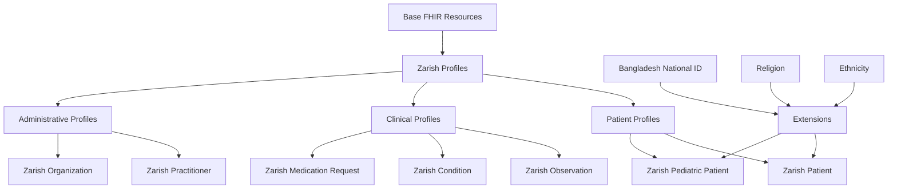

# Welcome to Zarish FHIR Profiles

**FHIR Profile Definitions for the ZarishSphere Platform**

This documentation provides comprehensive information about FHIR profiles, extensions, and implementation guides for the ZarishSphere Platform.

## 🎯 What are FHIR Profiles?

FHIR Profiles are constraints and extensions applied to base FHIR resources to meet specific implementation requirements. They define:

- **Required elements**: Which fields must be present
- **Cardinality constraints**: How many times an element can appear
- **Terminology bindings**: Which code systems and value sets to use
- **Extensions**: Additional data elements not in base FHIR

## 🚀 Quick Start

### Installation

```bash
git clone https://github.com/ZarishSphere-Platform/zarish-fhir-profiles.git
cd zarish-fhir-profiles
npm install -g fsh-sushi
```

### Build Profiles

```bash
sushi .
java -jar publisher.jar -ig ig.ini
```

## 📚 Available Profiles

### Patient Profiles

<div class="grid cards" markdown>

-   :material-account:{ .lg .middle } **Zarish Patient**

    ---

    Extended patient profile with Bangladesh-specific extensions for national ID, religion, and ethnicity.

    [:octicons-arrow-right-24: Learn more](profiles/zarish-patient.md)

-   :material-baby-face:{ .lg .middle } **Zarish Pediatric Patient**

    ---

    Specialized profile for pediatric patients with age-specific constraints and requirements.

    [:octicons-arrow-right-24: Learn more](profiles/zarish-pediatric-patient.md)

</div>

### Clinical Profiles

<div class="grid cards" markdown>

-   :material-heart-pulse:{ .lg .middle } **Zarish Observation**

    ---

    Profile for vital signs and clinical observations with standardized LOINC codes.

    [:octicons-arrow-right-24: Learn more](profiles/zarish-observation.md)

-   :material-medical-bag:{ .lg .middle } **Zarish Condition**

    ---

    Profile for diagnoses and health conditions using SNOMED CT and ICD-10.

    [:octicons-arrow-right-24: Learn more](profiles/zarish-condition.md)

-   :material-pill:{ .lg .middle } **Zarish Medication Request**

    ---

    Profile for medication prescriptions with RxNorm terminology bindings.

    [:octicons-arrow-right-24: Learn more](profiles/zarish-medication-request.md)

</div>

## 🔍 Profile Architecture



## 🧩 Extensions

Custom extensions for Bangladesh-specific requirements:

- [Bangladesh National ID](extensions/bd-national-id.md) - National identification number
- [Religion](extensions/religion.md) - Religious affiliation
- [Ethnicity](extensions/ethnicity.md) - Ethnic background
- [Occupation](extensions/index.md) - Patient occupation

## 📖 Implementation Guides

<div class="grid cards" markdown>

-   :material-book-open-variant:{ .lg .middle } **Getting Started**

    ---

    Learn how to use Zarish FHIR profiles in your applications.

    [:octicons-arrow-right-24: Get Started](guides/getting-started.md)

-   :material-code-braces:{ .lg .middle } **Profile Usage**

    ---

    Examples and best practices for implementing profiles.

    [:octicons-arrow-right-24: View Examples](guides/profile-usage.md)

-   :material-check-circle:{ .lg .middle } **Validation**

    ---

    How to validate resources against Zarish profiles.

    [:octicons-arrow-right-24: Learn Validation](guides/validation.md)

</div>

## 🌐 FHIR Compliance

All profiles comply with:

- **FHIR Version**: R4 (4.0.1)
- **Base Profiles**: US Core, International Patient Summary
- **Validation**: FHIR Validator conformance
- **Standards**: HL7 FHIR Profiling Guidelines

## 💡 Example Usage

### Creating a Zarish Patient

```json
{
  "resourceType": "Patient",
  "meta": {
    "profile": ["http://zarishsphere.org/fhir/StructureDefinition/zarish-patient"]
  },
  "extension": [
    {
      "url": "http://zarishsphere.org/fhir/StructureDefinition/bd-national-id",
      "valueString": "1234567890123"
    },
    {
      "url": "http://zarishsphere.org/fhir/StructureDefinition/religion",
      "valueCodeableConcept": {
        "coding": [{
          "system": "http://terminology.hl7.org/CodeSystem/v3-ReligiousAffiliation",
          "code": "1036",
          "display": "Islam"
        }]
      }
    }
  ],
  "identifier": [
    {
      "system": "http://zarishsphere.org/fhir/patient-id",
      "value": "PAT-001"
    }
  ],
  "name": [
    {
      "family": "Rahman",
      "given": ["Abdul"]
    }
  ],
  "gender": "male",
  "birthDate": "1990-01-15"
}
```

## 🔗 Related Resources

- [Zarish FHIR Data](https://zarishsphere-platform.github.io/zarish-fhir-data/) - Terminology Resources
- [Zarish FHIR Server](https://github.com/ZarishSphere-Platform/zarish-fhir-server) - FHIR API Implementation
- [FHIR Specification](https://www.hl7.org/fhir/) - Official FHIR Documentation

## 🤝 Contributing

We welcome contributions! See our [Contributing Guide](guides/contributing.md) for details on:

- Creating new profiles
- Adding extensions
- Updating documentation
- Submitting pull requests

---

**Ready to get started?** Check out our [Getting Started Guide](guides/getting-started.md)!
